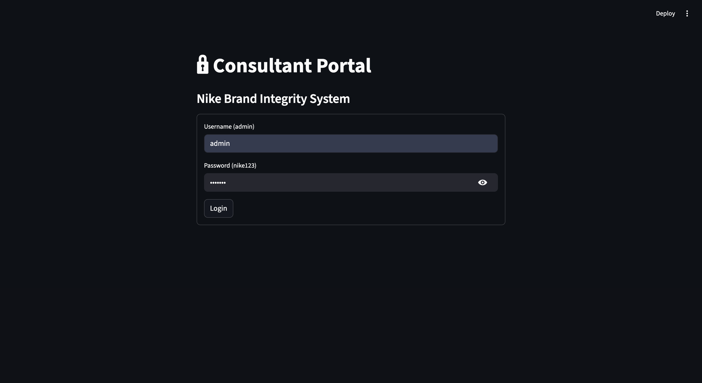
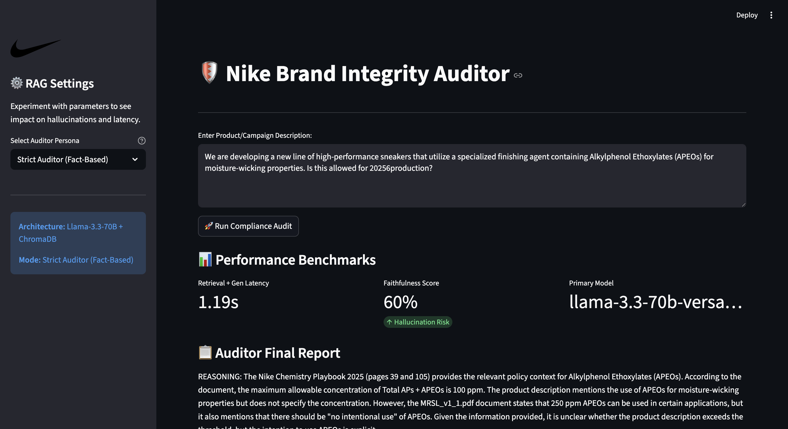
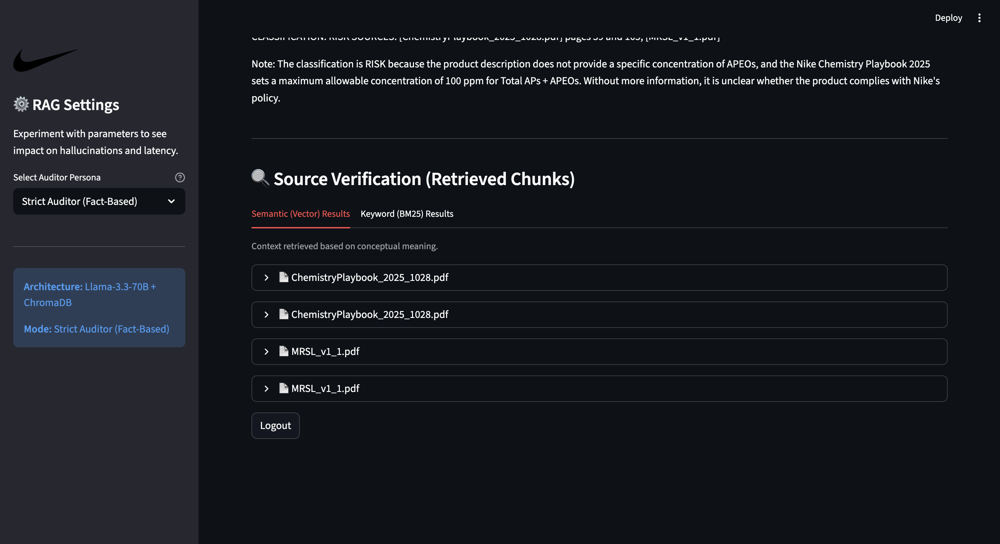

#  Nike Brand Integrity Auditor  
## RAG-Based Policy AI  

**Use Case:** Internal Policy Compliance Auditor  

---




## 📑 Project Overview

This project delivers a Retrieval-Augmented Generation (RAG) solution designed for Nike's Global Compliance team.

The **Nike Brand Integrity Auditor** allows internal stakeholders to evaluate:

- Product descriptions  
- Material choices  
- Manufacturing plans  

against Nike's **2024–2025 Sustainability, Labor, and Chemistry Playbooks**.

---

## ✨ Key Features

### 🔁 Dual-Model Pipeline
- **Llama 3.3 70B** → High-reasoning primary auditor  
- **Llama 3.1 8B** → Fast benchmarking & faithfulness evaluator  

---

### 🔍 Hybrid Retrieval
Combines:

- **Vector Semantic Search (ChromaDB)** → Conceptual policy matching  
- **BM25 Keyword Search** → Identifies specific chemical names & policy codes  

---

### 🧠 Strict Auditor Persona
- Zero-Trust System Prompt  
- Enforced Chain-of-Thought (CoT) reasoning  
- Structured Compliance Classification  

---

### 🔐 Security
- Mock login portal  
- Restricted access to proprietary policy data  

---

# 🏗️ Architecture & Model Selection

## LLM vs. SLM Justification

For this project, we selected a **Large Language Model (LLM)** over a Small Language Model (SLM) for the primary auditor role.

### ✅ Why LLM (Llama 3.3 70B)?

**1. Deep Reasoning**  
Policy auditing requires identifying subtle contradictions, for example:
- Substance allowed at *100ppm*
- But banned for *Intentional Use*

LLMs handle this multi-hop reasoning reliably.

**2. Zero-Shot Reliability**  
Maintains Nike’s strict brand voice without requiring fine-tuning.

---

### 🧪 Why Use an SLM?

The **Llama 3.1 8B model** acts as a Judge:

- Faster  
- Cost-effective  
- Used for faithfulness benchmarking  

---

# 🧪 Benchmarking & Evaluation Results

The system was benchmarked using a suite of edge-case compliance prompts.

Two generation modes were tested to measure hallucination and factual grounding.

---

## 📊 Summary of Results

| Mode | Avg. Latency | Avg. Faithfulness | Hallucination Risk |
|------|-------------|-------------------|--------------------|
| Strict (Temp 0.0) | 1.10s | 80% – 95% | Low |
| Creative (Temp 0.8) | 1.15s | 50% – 80% | High |

---

## 🔎 Key Performance Insights

### 🛑 Hallucination Control
At **Temperature = 0.0**, the system:
- Correctly flagged APEOs (500ppm vs 100ppm limit)
- Identified as **VIOLATION**
- 0.92s latency

---

### 📚 Logic Precision
Using enforced Chain-of-Thought:
- Correctly flagged a **72-hour work week**
- Violated Nike’s **60-hour Code Leadership Standard**

---

### 🌡 Temperature Impact
Increasing temperature to **0.8**:
- Reduced faithfulness by ~30%
- Caused policy extrapolation not found in source PDFs

---

# 🚀 Installation & Usage

---

## 1️⃣ Environment Setup

```bash
# Clone repository
git clone https://github.com/your-username/nike-rag-auditor.git
cd nike-rag-auditor

# Install dependencies
pip install -r requirements.txt
---

## 2️⃣ Data Ingestion

Place policy PDFs inside the `/data` folder.

Build the vector database:

```bash
python backend/ingestion.py
```

---

## 3️⃣ Run the App

Start the Streamlit portal:

```bash
streamlit run frontend/app.py
```

### 🔐 Login Credentials

- **Username:** admin  
- **Password:** nike123  

---

## 4️⃣ Run Benchmarks

Generate evaluation results for PPT:

```bash
python benchmark_prompts.py
```

This will produce:

```bash
evaluation_results.csv
```

---

# 📁 Project Structure

```
├── backend/
│   ├── config.py            # Latency & Model Settings
│   ├── engine.py            # RAG Pipeline & Judge Logic
│   ├── hybrid_retriever.py  # Vector + BM25 Logic
│   ├── ingestion.py         # PDF Processing
│   └── prompts.py           # Brand Voice & CoT Patterns
│
├── frontend/
│   └── app.py               # Streamlit UI
│
├── data/                    # Policy PDFs
├── vector_db/               # Chroma Persistence
├── benchmark_prompts.py     # Evaluation Script
└── README.md
```

---

# Note

The **Faithfulness Score** is the core KPI of this system.

In a production environment:

- Any score below **0.85**
- Automatically triggers **Human-in-the-Loop review**

This ensures Nike’s brand integrity remains uncompromised by AI creativity.

---

# 🎯 Takeaway

This project demonstrates:

- Secure AI system design  
- Hybrid Retrieval Architecture  
- Model benchmarking strategy  
- Hallucination mitigation  
- Transparent compliance reasoning  

A production-ready AI compliance framework.
